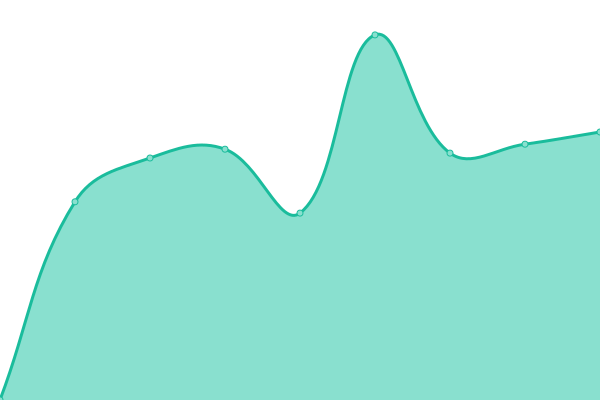

# [📈 Live Status](https://tsolenthaler.github.io/upptime): <!--live status--> **Alle Systeme sind betriebsbereit**

This repository contains the open-source uptime monitor and status page for [Thomas Solenthaler](https://tsolenthaler.github.io/upptime), powered by [Upptime](https://github.com/upptime/upptime).

With [Upptime](https://upptime.js.org), you can get your own unlimited and free uptime monitor and status page, powered entirely by a GitHub repository. We use [Issues](https://github.com/tsolenthaler/upptime/issues) as incident reports, [Actions](https://github.com/tsolenthaler/upptime/actions) as uptime monitors, and [Pages](https://tsolenthaler.github.io/upptime) for the status page.

<!--start: status pages-->
<!-- This summary is generated by Upptime (https://github.com/upptime/upptime) -->
<!-- Do not edit this manually, your changes will be overwritten -->
<!-- prettier-ignore -->
| URL | Status | History | Response Time | Uptime |
| --- | ------ | ------- | ------------- | ------ |
|  [tso.ch](https://tso.ch) | Verfügbar | [tso-ch.yml](https://github.com/tsolenthaler/upptime/commits/HEAD/history/tso-ch.yml) | 

 1481ms
     
 | 

<a href="https://tsolenthaler.github.io/upptime/history/tso-ch">100.00%</a>
    

|  [contentdesk.io](https://contentdesk.io) | Verfügbar | [contentdesk-io.yml](https://github.com/tsolenthaler/upptime/commits/HEAD/history/contentdesk-io.yml) | 

 2010ms
     
 | 

<a href="https://tsolenthaler.github.io/upptime/history/contentdesk-io">100.00%</a>
    

|  [glarnerland.ch](https://glarnerland.ch) | Verfügbar | [glarnerland-ch.yml](https://github.com/tsolenthaler/upptime/commits/HEAD/history/glarnerland-ch.yml) | 

 1250ms
     
 | 

<a href="https://tsolenthaler.github.io/upptime/history/glarnerland-ch">100.00%</a>
    

|  [thurgau-bodensee.ch](https://thurgau-bodensee.ch) | Verfügbar | [thurgau-bodensee-ch.yml](https://github.com/tsolenthaler/upptime/commits/HEAD/history/thurgau-bodensee-ch.yml) | 

 1499ms
     
 | 

<a href="https://tsolenthaler.github.io/upptime/history/thurgau-bodensee-ch">100.00%</a>
    

|  [hosting.tso.ch](46.231.200.190) | Verfügbar | [hosting-tso-ch.yml](https://github.com/tsolenthaler/upptime/commits/HEAD/history/hosting-tso-ch.yml) | 

 122ms
     
 | 

<a href="https://tsolenthaler.github.io/upptime/history/hosting-tso-ch">100.00%</a>
    

|  [mc21a2202.dnh.net](185.46.59.81) | Verfügbar | [mc21a2202-dnh-net.yml](https://github.com/tsolenthaler/upptime/commits/HEAD/history/mc21a2202-dnh-net.yml) | 

 121ms
     
 | 

<a href="https://tsolenthaler.github.io/upptime/history/mc21a2202-dnh-net">100.00%</a>
    

|  [ziggy.pim.tso.ch](https://ziggy.pim.tso.ch) | Verfügbar | [ziggy-pim-tso-ch.yml](https://github.com/tsolenthaler/upptime/commits/HEAD/history/ziggy-pim-tso-ch.yml) | 

 6341ms
     
 | 

<a href="https://tsolenthaler.github.io/upptime/history/ziggy-pim-tso-ch">99.65%</a>
    

|  [test.pim.tso.ch - Ohne PHP](https://test.pim.tso.ch) | Verfügbar | [test-pim-tso-ch-ohne-php.yml](https://github.com/tsolenthaler/upptime/commits/HEAD/history/test-pim-tso-ch-ohne-php.yml) | 

 537ms
     
 | 

<a href="https://tsolenthaler.github.io/upptime/history/test-pim-tso-ch-ohne-php">100.00%</a>
    

|  [ost.pim.tso.ch](https://ost.pim.tso.ch) | Verfügbar | [ost-pim-tso-ch.yml](https://github.com/tsolenthaler/upptime/commits/HEAD/history/ost-pim-tso-ch.yml) | 

 2059ms
     
 | 

<a href="https://tsolenthaler.github.io/upptime/history/ost-pim-tso-ch">100.00%</a>
    

|  [tgt.pim.tso.ch](https://tgt.pim.tso.ch) | Verfügbar | [tgt-pim-tso-ch.yml](https://github.com/tsolenthaler/upptime/commits/HEAD/history/tgt-pim-tso-ch.yml) | 

 2139ms
     
 | 

<a href="https://tsolenthaler.github.io/upptime/history/tgt-pim-tso-ch">100.00%</a>
    

|  [hlt.pim.tso.ch](https://hlt.pim.tso.ch) | Verfügbar | [hlt-pim-tso-ch.yml](https://github.com/tsolenthaler/upptime/commits/HEAD/history/hlt-pim-tso-ch.yml) | 

 2144ms
     
 | 

<a href="https://tsolenthaler.github.io/upptime/history/hlt-pim-tso-ch">100.00%</a>
    

|  [alar.pim.tso.ch](https://alar.pim.tso.ch) | Verfügbar | [alar-pim-tso-ch.yml](https://github.com/tsolenthaler/upptime/commits/HEAD/history/alar-pim-tso-ch.yml) | 

 2075ms
     
 | 

<a href="https://tsolenthaler.github.io/upptime/history/alar-pim-tso-ch">100.00%</a>
    

|  [Exoscale - Object Storage SOS - Ziggy](https://sos-ch-dk-2.exo.io/ziggypimtsoch/catalog/f/b/8/b/fb8b6445a2f864ac4532703d8ce8941d9233f814_Stiftsbibliothek_St._Gallen_1.jpg) | Verfügbar | [exoscale-object-storage-sos-ziggy.yml](https://github.com/tsolenthaler/upptime/commits/HEAD/history/exoscale-object-storage-sos-ziggy.yml) | 

 1151ms
     
 | 

<a href="https://tsolenthaler.github.io/upptime/history/exoscale-object-storage-sos-ziggy">100.00%</a>
    

|  [Exoscale - Object Storage SOS - Ziggy mit CDN](https://ziggypimtsoch.sos-ch-dk-2.exoscale-cdn.com/catalog/f/b/8/b/fb8b6445a2f864ac4532703d8ce8941d9233f814_Stiftsbibliothek_St._Gallen_1.jpg) | Verfügbar | [exoscale-object-storage-sos-ziggy-mit-cdn.yml](https://github.com/tsolenthaler/upptime/commits/HEAD/history/exoscale-object-storage-sos-ziggy-mit-cdn.yml) | 

 174ms
     
 | 

<a href="https://tsolenthaler.github.io/upptime/history/exoscale-object-storage-sos-ziggy-mit-cdn">100.00%</a>
    

|  [AI Chat Test](https://tourismus-chat.vercel.app/) | Verfügbar | [ai-chat-test.yml](https://github.com/tsolenthaler/upptime/commits/HEAD/history/ai-chat-test.yml) | 

 889ms
     
 | 

<a href="https://tsolenthaler.github.io/upptime/history/ai-chat-test">100.00%</a>
    

<!--end: status pages-->

[**Visit our status website →**](https://tsolenthaler.github.io/upptime)

## 📄 License

- Powered by: [Upptime](https://github.com/upptime/upptime)
- Code: [MIT](./LICENSE) © [Anand Chowdhary](https://anandchowdhary.com), supported by [Pabio](https://pabio.com)
- Data in the `./history` directory: [Open Database License](https://opendatacommons.org/licenses/odbl/1-0/)
